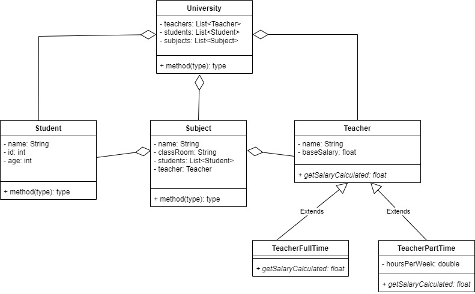
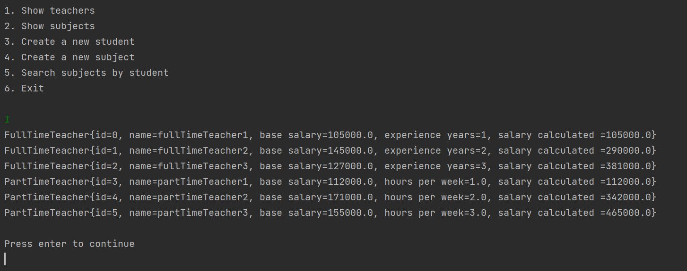
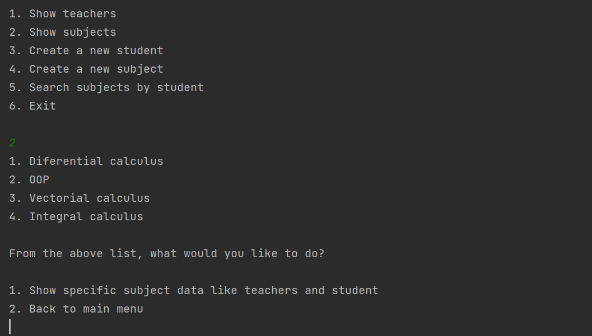
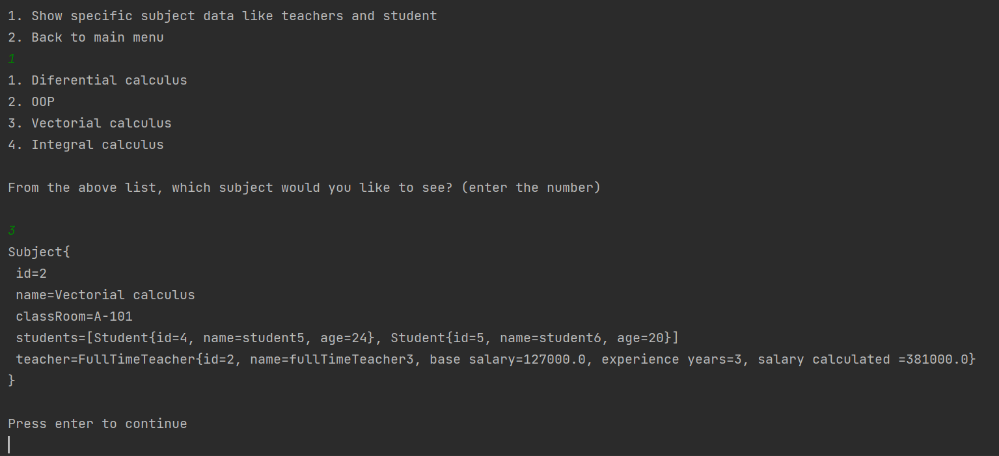
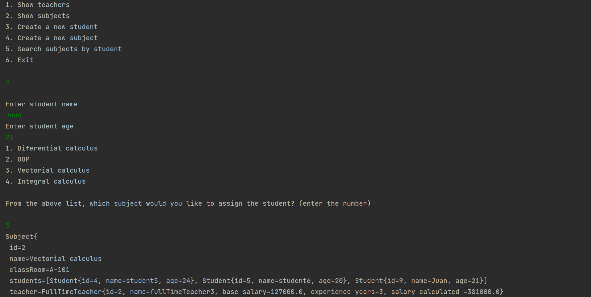
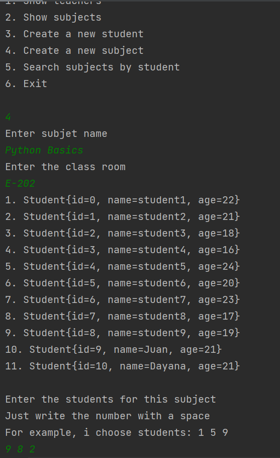
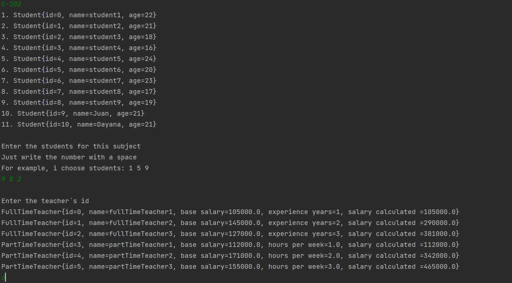
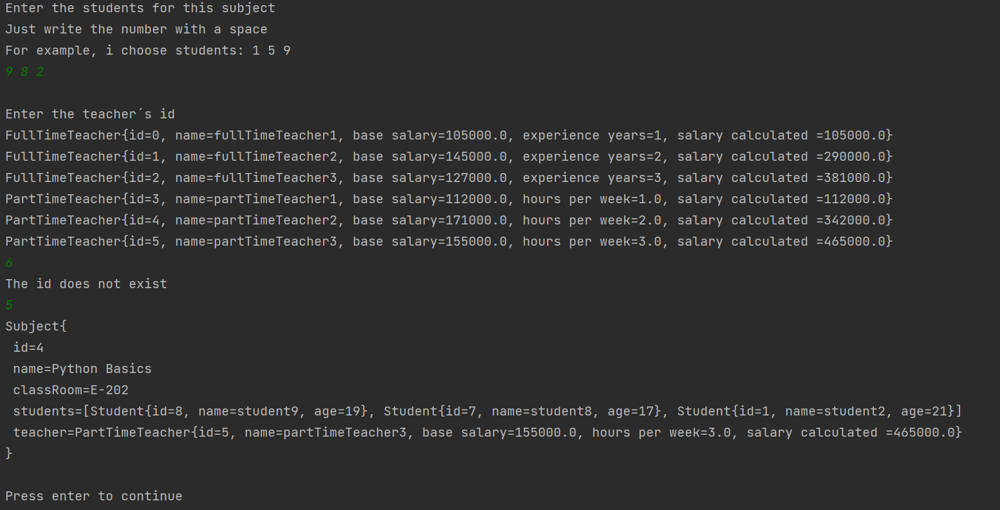
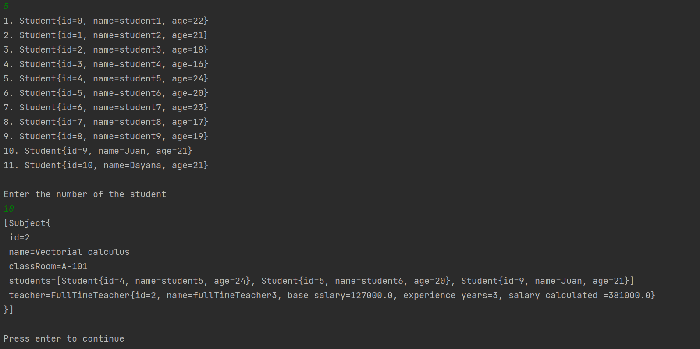

# JavaBasicsModule!

## Introduction
The idea of this project is to track a university classes, teachers and students, how to create a new class, a new student and how to add a student and teacher in a class, you can see the list of students and teachers, and finally, search in which classes are one student.

## Architecture

The first version of our class diagram is the version that you can see, but, the final version change a bit, I consider inserting an interface that control all services that the university use, like add a student to a new class, the main idea is approach the polymorphism in java.

## How to use it?

### Prerequisites
 1. Java 8

First you hace to start the project running the main class, you can find it in main package, contain Main class.
Then in console, you will see this menu, in particular look how the first option work, that show you all the teachers.

After each option is common that you need to press the key enter to continue, because it let you see properly the answer and then see again the main menu.
Then the second option show you all the name of the classes, then you have a sub menu, if you want to see a specific class, you choose the option 1 and then choose the class you want or, just choose the second option to back to main menu.

The third option will allow you to create a new student and insert it in an existing class.

The fourth option will allow you to create a new class, and it is divided into three parts, the first part needs you to insert the name of the class, the classroom, in the example it works like this: block and class per floor and then it will show you all the students and then you will choose the students you want in your class, the second part needs you to choose a teacher and finally how the class was set up.

Fifth option, choose a student, and then it will show you all classes that the student is inscribe.

Finally, the sixth option, finish the work.

## Author ✒️

* **Sebastian Nieto** - [sebastianNieto](https://github.com/sebastianNietoMolina)
